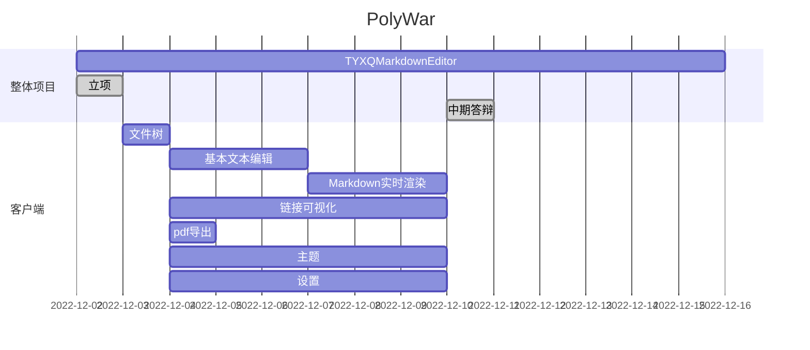

# 项目立项报告草稿

> **小组成员：**
>
> 组长：肖斌
>
> 组员：唐博文 杨鹏 邱宇新

## 目录

[TOC]

---

分工：

- 肖斌：文件树
- 唐博文：
- 杨鹏：

## 一、项目介绍

**软件名称：**

- TYXQMarkdownEditor

**功能点描述：**

- 核心功能

  - 编辑器
    - 文件树
    - 多标签
    - 左右/上下分屏

  - Markdown编辑
    - 实时预览

    - 导出pdf

- 拓展功能

  - 图片、视频、音频预览
  - 代码块增强
    - python解释运行
    - c/cpp编译运行
    - java编译运行
  - 链接可视化

  - 其他功能
    - 主题配色设置
    - 局域网下演示功能（共享给多台设备观看）
    - 局域网下协作功能（共享给多台设备协作）
    - 账号登陆 - 设置同步
  - ......

**技术方案**：

- GUI：C/C++ QT

- 服务端（账号数据维护）：Golang + GORM

