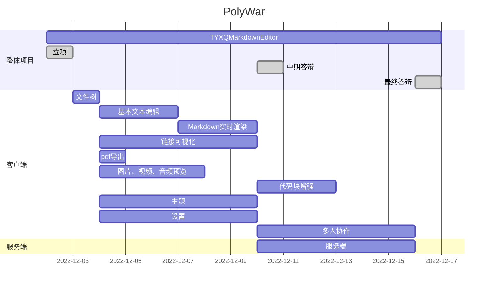
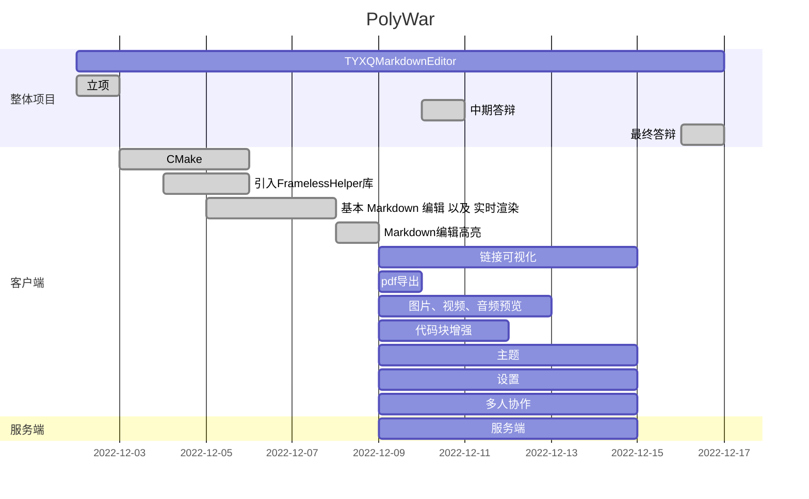

# Draft

### 计划：

### 实际：

### STH：

#### 1> 核心功能

- 编辑器
  - 文件树 XB
  - 多标签
  - 左右/上下分屏

- **Markdown编辑**
  - **实时预览**

    Markdown词法分析
  
  - 导出pdf

#### 2> 拓展功能

- 图片、视频、音频预览
- 代码块增强
  - python解释运行
  - c/cpp编译运行
  - java编译运行
- 链接可视化 XB

- 其他功能
  - 主题配色设置（深色浅色切换）
  - 局域网下演示功能（共享给多台设备观看）
  - 局域网下协作功能（共享给多台设备协作）
  - 账号登陆 - 设置同步
- ......

#### 3> 参考即注意事项

需要使用 msvc 编译（因为Windows下 WebEngine 模块在 msvc 里才有）

##### 项目参考

- [cloose/CuteMarkEd: Qt Markdown Editor (github.com)](https://github.com/cloose/CuteMarkEd)

##### 开源库

- [wangwenx190/framelesshelper: Cross-platform window customization framework for Qt Widgets and Qt Quick. Supports Windows, Linux and macOS. (github.com)](https://github.com/wangwenx190/framelesshelper)
- [pbek/qmarkdowntextedit: A C++ Qt QPlainTextEdit widget with markdown highlighting support and a lot of other extras (github.com)](https://github.com/pbek/qmarkdowntextedit)

##### 一些文章

- 如何使用 C++ 库：[c++ - How to use Libraries - Stack Overflow](https://stackoverflow.com/questions/10358745/how-to-use-libraries)

- [Qt官方示例-Markdown编辑器 - 知乎 (zhihu.com)](https://zhuanlan.zhihu.com/p/88771103)
- [Qt实现文本编辑器（一） - 知乎 (zhihu.com)](https://zhuanlan.zhihu.com/p/461346513)
- [[QT小项目练习]TextEditor 一个简单的文本编辑器 - 知乎 (zhihu.com)](https://zhuanlan.zhihu.com/p/35012666)
- [QT实时保存的简单纯文本编辑器 - 知乎 (zhihu.com)](https://zhuanlan.zhihu.com/p/579012389)
- [(1 封私信 / 14 条消息) 用Qt如何实现一个能够列选取的文本编辑器？ - 知乎 (zhihu.com)](https://www.zhihu.com/question/57444362/answer/152994644)

- [(1 封私信 / 14 条消息) 如何使用 QtWidget 写出好看的界面？ - 知乎 (zhihu.com)](https://www.zhihu.com/question/460991049/answer/1908111553)

- [CMake 良心教程，教你从入门到入魂 - 知乎 (zhihu.com)](https://zhuanlan.zhihu.com/p/500002865)

#### Preview部分

- [cjmdaixi/QuickMarkdownViewer: Simple markdown viewer written in Qt Quick. (github.com)](https://github.com/cjmdaixi/QuickMarkdownViewer)

- [qyvlik/MarkdownEditor: 使用 QML 和 Markdown.Converter.js 实现的 Markdown 编辑器，特性少得可怜 (github.com)](https://github.com/qyvlik/MarkdownEditor)

- [Qt Quick渲染Markdown文本 - 知乎 (zhihu.com)](https://zhuanlan.zhihu.com/p/44102857)

- [QML中能使用什么JS库 - 知乎 (zhihu.com)](https://zhuanlan.zhihu.com/p/34307199)

- [quickly/quickly: ES6 and Node.js-like environment for QML (github.com)](https://github.com/quickly/quickly)

- [trollixx/node.qml: A port of Node.js to QML (github.com)](https://github.com/trollixx/node.qml)

- [Markdown 解析原理详解和 Markdown AST 描述 - D 的个人博客 (b3log.org)](https://88250.b3log.org/articles/2020/04/23/1587637426085.html)
- [C++ 打造 Markdown 解析器_牛客博客 (nowcoder.net)](https://blog.nowcoder.net/n/1e0817a420b94d118c01c60be195f1cc)
