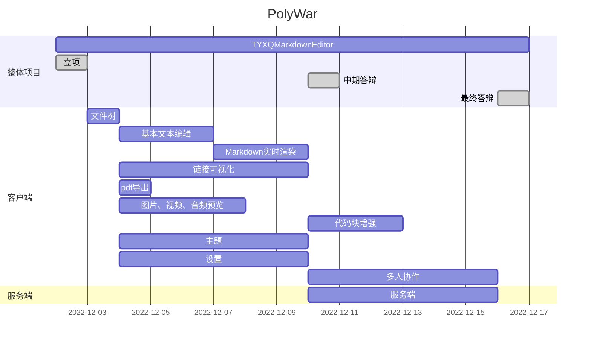

# 项目立项报告

> **小组成员：**
>
> 组长：肖斌
>
> 组员：唐博文 杨鹏 邱宇新

## 目录

[TOC]

---

## 一、项目介绍

### 1. 软件介绍

Markdown 是一种轻量级标记语言，创始人为约翰·格鲁伯（John Gruber）。 它允许人们使用易读易写的纯文本格式编写文档，然后转换成有效的 XHTML（或者HTML）文档。这种语言吸收了很多在电子邮件中已有的纯文本标记的特性。

由于 Markdown 的轻量化、易读易写特性，并且对于图片，图表、数学式都有支持，许多网站都广泛使用 Markdown 来撰写帮助文档或是用于论坛上发表消息。 如 GitHub、Reddit、Diaspora、Stack Exchange、OpenStreetMap 、SourceForge、简书等，甚至还能被使用来撰写电子书。

常见的 Markdown 编辑器有 Typora、MarkText、Obsidian等。

本组软件名称为：TYXQMarkdownEditor，具体实现的功能如下。

### 2. 功能点描述

#### 1> 核心功能

- 编辑器
  - 文件树
  - 多标签
  - 左右/上下分屏

- Markdown编辑
  - 实时预览

  - 导出pdf

#### 2> 拓展功能

- 图片、视频、音频预览
- 代码块增强
  - python解释运行
  - c/cpp编译运行
  - java编译运行
- 链接可视化

- 其他功能
  - 主题配色设置
  - 局域网下演示功能（共享给多台设备观看）
  - 局域网下协作功能（共享给多台设备协作）
  - 账号登陆 - 设置同步
- ......

### 3. 技术方案选择

#### 1> 客户端

采用 C/C++、Qt 进行编写。

本项目采用 C/C++作为项目的开发语言。 C++是 C 语言的继承，它既可以进行 C 语言的过程化程序设计，又可以进行以抽象数据类型为特点的基于对象的程序设计，还可以进行以继承和多态为特点的面向对象 的程序设计。C++擅长面向对象程序设计的同时，还可以进行基于过程的程序设计，因而 C++ 就适应的问题规模而论，大小由之。C++不仅拥有计算机高效运行的实用性特征，同时还致力于提高大规模程序的编程质量与程序设计语言的问题描述能力。 

C++的优势：

- 语言简洁、紧凑，使用方便、灵活；拥有丰富的运算符；
- 生成的目标代码质量高，程序执行效率高,可移植性好; 
- C++程序在可重用性、可扩充性、可维护性和可靠性等方面都较高，使其适合开发大中型的系统软件和应用程序; 
- 支持面向对象编程机制，如信息隐藏、封装函数、抽象数据类型、继承、多态、函数重载、运算符重载、泛型编程（模板)，团队开发更简 单

Qt 是一个跨平台的 C++图形用户界面应用程序框架。它为应用程序开发者提供建立艺术级图形界面所需的所有功能。它是完全面向对象的，很容易扩展，并且允许真正的组件编程。基本上，Qt 同 X Window 上的 Motif， Openwin，GTK 等图形界面库和 Windows 平台上的 MFC，OWL，VCL，ATL 是同类型的东西。 自从 1996 年早些时候，Qt 进入商业领域，它已经成为全世界范围内数千种成功的应用程序基础。Qt 也是流行的 Linux 桌面环境 KDE 的基础，KDE 是所有主要的 Linux 发行版的一个标准组件。Qt 的特点有：可移植性、易用性、执行速度快等特点。 

Qt 的优势： 

- XML 支持。
- 大量的开发文档
- 支持 2D/3D 图形渲染，支持 OpenG
- 优良的跨平台特性，Qt 支持众多系统。
- 面向对象，Qt 良好的封装机制使得 Qt 的模块化程度非常高，可重用性较好，对于用户开发来说是非常方便的。Qt 提供了一种称为 signals/slots 的安全类型来替代 callback，这使得各个元件之间的协同 工作变得十分简单。
- 丰富的 API，Qt 包括多达 250 个以上的 C++类，还提供基于模板的 collections，serialization，file，I/O device, directory， management，date/time 类。甚至还包括正则表达式的处理功能。

#### 2> 服务端

采用 Golang + GORM 库。

Golong 是一种静态强类型，编译性语言。Golong 语言语法与 C 相近，但功能上有： 内存安全，垃圾回收，结构形态及 CSP-style 并发计算。

GROM 是 Golong 语言数据库框架，功能强大，如全功能 ORM，关联（Has One，Has Many，Belongs To，Many to Many，多态，单表继承），批量插入，FindInBatches， Find/Create with Map，使用 SQL 表达式，Context Valuer 进行 CRUD 等，适合用于服 务端的账号数据维护。

## 二、项目小组成员及初步分工

肖斌：架构设计、服务端实现、功能开发（25%）

唐博文：界面设计、交互设计、基本功能实现（25%）

杨鹏：需求分析、基本功能实现（25%）

邱宇新：PPT与文档编写（25%）

## 三、项目管理相关

### 1. 版本管理工具

git

### 2. 代码托管平台

github

### 2. 项目管理平台

pingcode

### 3. 项目开发模型

采用增量模型。

增量模型是把待开发的软件系统模块化，将每个模块作为一个增 量组件，从而分批次地分析、设计、编码和测试这些增量组件。运用增量模型的软件开发过程是递增式的过程，采用增量模型进行开发，开发人员不需要一次性地把整个软件产品提交给用户，而是可以分批次进行提交。 

增量模型的最大特点就是将待开发的软件系统模块化和组件化，将待开发的软件系统模块化，可以分批次地提交软件产品，使用户可以及时了解软件项目的进展；以组件为单位进行开发降低了软件开发的风险，一个开发周期内的项目不会影响到整个软件系统；此外增量模型的开发顺序灵活，开发人员可以对组件的实现顺序进行优先级排序，先完成需求稳定的核心组件，当组件的优先级发生变化时，还能及时地对实现顺序进行调整。

### 4. 项目开发进度初步计划

